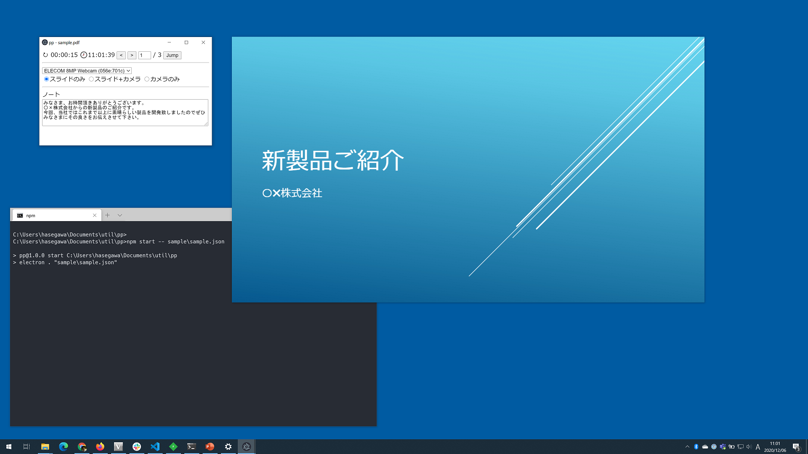

# pp - PDF presentation helper for online meetings

ppはオンラインでのセミナーやミーティングに最適なPDFファイルのプレゼンテーション表示ツールです。
PDFファイルをフレームレスウィンドウ内に表示させるので、オンライン配信サービスでそのウィンドウだけを共有することで、リモートには綺麗なスライドだけが表示されます。
また、PDF本体とは別にオンラインに配信されない操作用ウィンドウ上にはページごとのノート機能も表示することが可能です。



## 起動方法

そのままppを起動すると、表示させるPDFファイルあるいはpp構成ファイル(後述)を選択するための「ファイルを開く」ダイアログが表示されます。
```
C:\>npm start
```

または、コマンドラインでPDFファイルやpp構成ファイルのファイル名を指定して起動することもできます。
```
C:\>npm start -- sample\sample.pdf
C:\>npm start -- sample\sample.json
```

## pp構成ファイル

pp構成ファイルは、表示したいPDFのファイル名とページごとのノートを記述したJSON形式のファイルです。

```json
{
  "pdffile": "PDFのファイル名。円記号\は「\\」のように重ねて記述する必要があることに注意。",
  "notes": {
    "1": "1ページ目のノート",
    "2": "2ページ目のノート",
    "n": "nページ目のノート"
  }
}
```

## 操作方法

PDFウィンドウ上の右半分をクリックするとページが進み、左半分をクリックするとページが戻ります。
Shiftキーを押しながらPDFウィンドウ上でマウスカーソルを動かすと、カーソルがレーザーポインターになります。
PDFウィンドウの上辺付近をドラッグすることでウィンドウ位置を変更することができます。

## 動作環境

Windows 10上でのみ動作確認を行っています。

